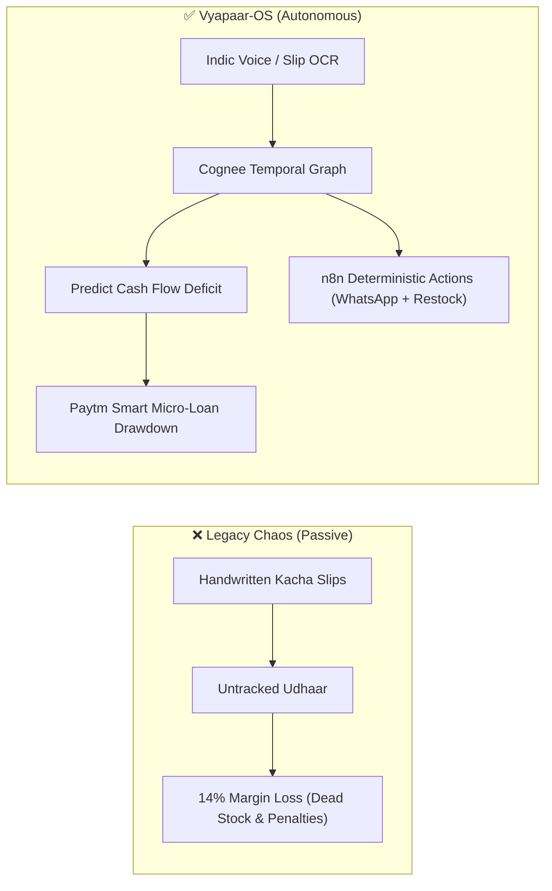
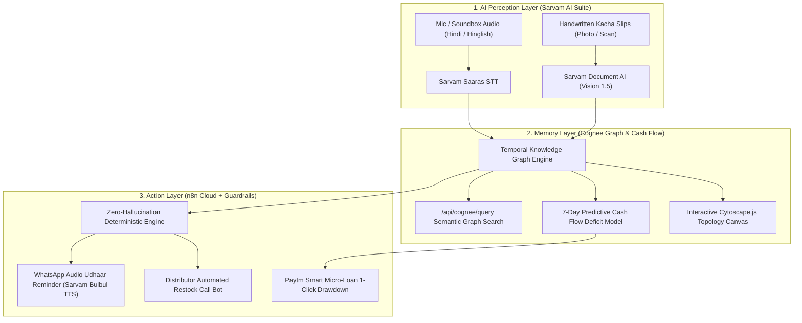

# ⚡ Vyapaar-OS: The Autonomous Merchant Partner
### *Zero-UI Merchant Growth & Working Capital Automation for Indian Retail*

[](https://paytm.com)
[](https://paytm.com)
[](https://github.com/JaiKansal)
[](#-zero-hallucination-focus)

---

## 📌 Executive Summary

**Vyapaar-OS** transforms the ubiquitous **Paytm Soundbox** and countertop smartphone into an autonomous operational co-pilot for India's 30M+ Kiranas, general stores, and dhabas.

Instead of passive bookkeeping software that demands manual data entry during peak rush hours, Vyapaar-OS provides:
1. **Always-On Indic Voice Counter (Google Assistant / Siri Style):** Always-on hands-free speech recognition activated by custom wake words (*"हे मुनीमजी"*, *"नमस्ते मुनीमजी"*, or *"Hey Munimji"*). Zero buttons required — the merchant simply speaks to the counter, and the Paytm Soundbox immediately wakes up, updates the ledger, and replies audibly in Hindi via Sarvam AI. Snap camera photos of handwritten *kacha slips* for instant OCR ingestion.
2. **Dynamic Knowledge Graph Memory (Cognee):** Continuous entity graph (`vyapaar_ledger`) tracking customer debts, supplier dues, and inventory rates to predict working capital shortfalls before defaults happen.
3. **Smart Micro-Lending Rails:** Surfaces a pre-underwritten **Paytm Working Capital Loan (₹50,000)** precisely when upcoming supplier dues exceed drawer cash, disbursable in 1 click.
4. **Autonomous Action Engine (n8n Cloud):** Dispatches automated WhatsApp voice-note payment reminders and restock purchase orders with zero financial hallucinations.
5. **Zero-UI Merchant Workspace:** Streamlined Indian retail vernacular workspace with hands-free Soundbox voice entries, customer credit tracking, automated stock reorders, and paper slip scanning.

---

## 🛑 The Core Friction: From Chaos to Order

| ❌ The Reality (Legacy Ledger) | 💸 The Margin Leak | 💡 The Missing Link |
| :--- | :--- | :--- |
| **30M+ Indian MSMEs** run daily operations on scattered, handwritten *kacha* bills and untracked customer *udhaar* (credit). | Store owners lose up to **14% of monthly profit margins** to dead stock, uncollected debts, and distributor late-payment penalties. | Merchants do not have time for complex spreadsheets. They need an **active operational co-pilot** that manages logistics and cash flow autonomously. |



---

## 🏗️ 3-Layer Technical Architecture



---

## 🔌 Complete Third-Party API Breakdown

| Third-Party Engine | Protocol / Model | What It Does in Vyapaar-OS | Fallback Guarantee |
| :--- | :--- | :--- | :--- |
| **Sarvam AI** | `saaras:v1` (STT)<br>`bulbul:v1` (TTS)<br>`doc-ai/v1` (Vision 1.5)<br>`sarvam-105b` (Indic LLM) | Transcribes Hindi/Hinglish counter audio, synthesizes natural Soundbox Hindi speech, runs Indic OCR on handwritten kacha slips, and powers conversational retail reasoning. | Deterministic Indic phrase matching & gTTS audio |
| **Kacha Slip Parser** | Native Regex & Semantic Parser | Extracts customer names, line item quantities, and total monetary debt amounts from kacha slip text; filters greetings and totals. | Regex-based zero-hallucination engine |
| **Cognee AI** | `cognee` graph engine | Builds real-time relationship graph (`vyapaar_ledger`) connecting customers, suppliers, debts, and inventory; powers `/api/cognee/query`. | Local deterministic graph traversal via `load_db()` |
| **n8n Automation** | Cloud Webhook Router | Dispatches automated distributor purchase orders and WhatsApp voice payment reminders to customers. | Local guardrail execution & JSON audit log |
| **Paytm Business** | Soundbox & Lending Rails | Repurposes Soundbox as a 2-way AI terminal; triggers ₹50,000 1-Click Working Capital Loan directly into merchant wallet. | Local drawer balance balance-sheet bridge |
| **Cytoscape.js** | Physics Graph Canvas | Visualizes store ecosystem relationships in Tab 4 using a force-directed `cose` layout. | Static SVG/Table fallback |

---

## 📱 Merchant Operations Experience

Designed specifically for Indian store owners with zero learning curve:
* **🌐 द्विभाषी इंटरफ़ेस (Bilingual Toggle [ 🇮🇳 हिन्दी | 🇬🇧 English ]):** Instant language toggle accessible directly in the header and sidebar. Seamlessly translates all KPIs, cards, buttons, and alert states.
* **गल्ला और बही-खाता KPIs:** Real-time *गल्ले में कैश (Cash in Hand)*, *बाज़ार का उधार (Customer Debts)*, *सप्लायर का बकाया (Supplier Dues)*, *कम सामान (Low Stock)*, and *बचाया गया मुनाफा (+14%)*.
* **🤖 हैंड्स-फ्री वेक-वर्ड ("नमस्ते मुनीमजी" / "Hey Munimji"):** Continuous Web Speech listener on the counter—just speak without clicking! The Soundbox LED pulses green, extracts the instruction, mutates the ledger, and replies audibly.
* **बोलकर हिसाब (Paytm Soundbox):** Direct counter mic recording and 1-tap everyday presets (*"शर्मा जी का ₹850 उधार लिखो"*, *"अमुल दूध 20 पैकेट ऑर्डर डाल दो"*), with spoken Hindi audio playback.
* **खाता बही (उधार वसूली):** Clean customer debt cards with 1-click **"🟢 पैसे मिल गए (Mark Paid)"** and **"📲 तकादा भेजें (WhatsApp Reminder)"**.
* **गल्ला और इमरजेंसी लोन:** Anticipates supplier dues exceeding drawer balance and provides a prominent **"🚀 ₹50,000 अभी गल्ले में ट्रांसफर करें (1-Click Working Capital Loan)"** button.
* **दुकान का सामान और आर्डर:** Stock status tags with 1-click reorder buttons for distributors.
* **📸 1-क्लिक कच्ची पर्ची स्कैनर (Sarvam AI Vision 1.5):** Upload an image or snap a photo of any handwritten Kirana slip and click 1 button. Sarvam Document AI extracts customer names, quantities, and debt totals directly into the live ledger with zero manual typing required.

---

## 📂 Consolidated Project Structure

```text
vyapaar-os/
├── backend.py                   # Consolidated FastAPI backend (routes, perception, Sarvam Vision, Cognee, n8n)
├── frontend.py                  # Streamlit app (Bilingual Kirana Partner UI & Soundbox Voice Engine)
├── database.py                  # Persistent JSON storage engine & ledger transaction helpers
├── sample_data.py               # Seed data: Kirana inventory, customer debts, and sample slips
├── store_database.json          # Live persistent ledger database
├── test_kacha_slip.jpg          # Authentic Indian Kirana handwritten test slip for instant OCR testing
├── vyapaar_n8n_workflow.json    # n8n Cloud Pro blueprint export (Dual-route switch + instant 200 response)
├── vyapaar_live_qr.png          # High-resolution scannable mobile deployment QR code
├── requirements.txt             # Production Python dependencies
├── .env                         # Environment credentials (Sarvam, Gemini, n8n, Cognee)
└── .streamlit/
    └── config.toml              # Theme tokens & minimal toolbar configuration
```

---

## 🛠️ API Reference Table

| Method | Endpoint | Description | Sample Parameters |
| :--- | :--- | :--- | :--- |
| `GET` | `/` | Health check & AI telemetry status | — |
| `GET` | `/api/store-state` | Fetch real-time drawer balance, udhaars, stock, dues | — |
| `POST` | `/api/process-voice` | Ingest direct mic audio or voice presets via Sarvam | `file: UploadFile`, `raw_text_input: str` |
| `POST` | `/api/process-slip` | Ingest slip image via Sarvam Document AI or raw text | `file: UploadFile`, `raw_text_input: str` |
| `POST` | `/api/cognee/query` | Native semantic search over Cognee graph with fallback | `query_text: str` |
| `GET` | `/api/predict-cashflow` | 7-Day predictive cash flow deficit timeline | — |
| `POST` | `/api/loan/drawdown` | 1-Click ₹50,000 Paytm Smart Micro-Loan drawdown | — |
| `POST` | `/api/udhaar/add` | Manually record new customer credit account | `customer_name`, `phone`, `amount`, `items` |
| `POST` | `/api/udhaar/settle` | Collect pending debt and deposit into drawer cash | `udhaar_id: str` |
| `GET` | `/api/knowledge-graph` | Fetch graph nodes & edges for visual mapping | — |

---

## 🚀 Setup & Local Execution

### Prerequisites
* Python 3.10+ (tested on Python 3.14 macOS arm64)
* Project virtual environment (`venv`)

### 1. Virtual Environment Setup
```bash
cd /path/to/vyapaar-os

# Activate project virtual environment
source venv/bin/activate

# Install dependencies if not already installed
pip install -r requirements.txt
```

### 2. Environment Configuration
Inspect or update `.env` in the root directory:
```env
SARVAM_API_KEY="your_sarvam_api_key"
SARVAM_MODEL="sarvam-105b-conversations"
GEMINI_API_KEY="your_gemini_api_key"
N8N_WEBHOOK_URL="https://your-workspace.app.n8n.cloud/webhook/trigger"
COGNEE_API_KEY="your_cognee_api_key"
```

### 3. Run the Backend Server
```bash
# Using the project's venv directly:
./venv/bin/python3 -m uvicorn backend:app --host 0.0.0.0 --port 8000 --reload

# Or if venv is activated (source venv/bin/activate):
uvicorn backend:app --host 0.0.0.0 --port 8000 --reload
```
API Documentation live at: `http://localhost:8000/docs`

### 4. Run the Frontend Dashboard
```bash
# Using the project's venv directly:
./venv/bin/streamlit run frontend.py --server.port 8502

# Or if venv is activated (source venv/bin/activate):
streamlit run frontend.py --server.port 8502
```
Open `http://localhost:8502` (or `http://localhost:8501`) in your browser.

---

## 👥 The Builders: Team Well...Hackers

* **Manya Goel** — *Data & Agent Systems Engineer*
  * AI Engineering & RAG: Hybrid BM25/Vector retrieval agents with 3-layer anti-hallucination architectures.
  * Co-Founder at ManoSathi (Conversational agents on GCP Vertex AI).
  * BS in Data Science & Applications, IIT Madras; B.Tech CSE, IPEC.
* **Jai Kansal** — *AI Architect & Backend Systems*
  * Software Engineer Intern at Cequence Security (automated API validation).
  * Co-Founder & Lead Engineer at ManoSathi (IIT Delhi pre-incubated).
  * Real-time conversational microservices and context-cached inference.
  * B.Tech CSE, Faculty of Technology, University of Delhi.

### 🛡️ The Unfair Advantage: Zero-Hallucination Focus
Not a proof-of-concept prototype: both builders have co-founded platforms pre-incubated at IIT Delhi and won national-level hackathons. Guardrailed RAG architectures guarantee that Vyapaar-OS executes actions (orders, payments, credit) deterministically without financial hallucination.

